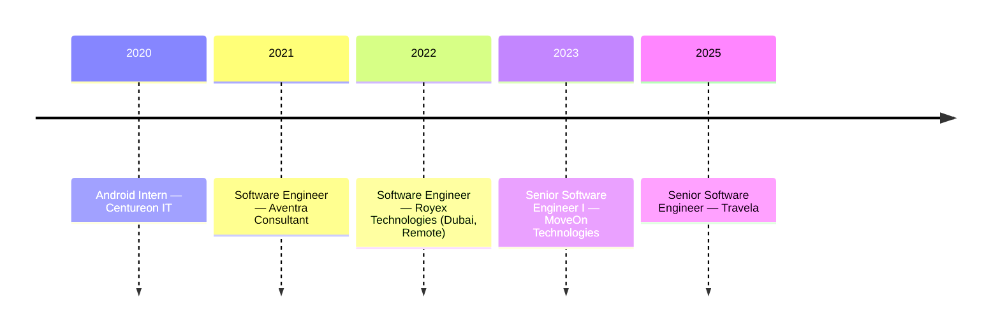

<p align="center">
  
</p>

<p align="center">
  <a href="https://azharulislam.site">
    
  </a>
</p>

<p align="center">
  <a href="https://azharulislam.site"></a>
  <a href="https://www.linkedin.com/in/azharcse/"></a>
  <a href="mailto:mdazharcse14@gmail.com"></a>
  
</p>

---

##  About Me


> *I make apps you can touch, backends you can trust, and occasionally break things just to understand them better.*

```dart
class AzharulIslam {
  final role       = "Senior Software Engineer @ Travela";
  final location   = "Dhaka, Bangladesh 🇧🇩";
  final experience = "~6 years";
  final mobile     = ["Native Android", "Native iOS", "Flutter"];
  final backend    = ["Go", "SQL", "PostgreSQL", "SQLite"];
  final learning   = "Rust, via Flutter FFI 🦀";
  final funFact    = "Bug whisperer — I talk to code until it listens 🐛";
}
```

- 📱 Own apps **end to end** — from sketch to release
- 🧭 Previously **led the mobile team** at MoveOn and mentored developers
- 🗄️ Lately focusing more and more on **backend**
- 🧱 Build reusable packages & modules that cut delivery time

<br clear="right" />

---

## 🛠️ Tech Stack

<p align="center">
  
  <br/>
  
</p>

| Area | Stack |
|---|---|
| **Mobile** | Native Android (Kotlin, Jetpack Compose) · Native iOS (Swift, SwiftUI) · Flutter (Dart) |
| **Backend & Data** | Go · SQL · PostgreSQL · SQLite · REST · GraphQL · WebSockets · Offline-first sync · Hive · Drift · ObjectBox |
| **Architecture & State** | Clean Architecture · MVVM · SOLID · Repository · DI · BLoC · GetX · Signals |
| **Integrations** | FCM · Payments · Maps & Geolocation · Analytics & Crashlytics · Localization & RTL · Agora SDK |
| **Testing & Tooling** | Unit / Widget / Integration tests · GitHub Actions CI/CD · Sentry · FVM · Method Channel · FFI |

---

## 💼 Experience



<details>
<summary><b>🔍 Click for details</b></summary>

#### 🏢 Senior Software Engineer — **Travela** · *Mar 2025 – Present*
Lead mobile for a travel booking & accommodation platform and own it end to end — architecture, state management, performance, releases — while helping on the backend.

#### 🏢 Senior Software Engineer I — **MoveOn Technologies** · *Sep 2023 – Feb 2025*
Led the Mobile Application Team. Launched **MoveOn: Global Shop & Ship** on iOS plus internal tools (Shipping Partner, DW-Admin) for a cross-border e-commerce & shipping platform.

#### 🏢 Software Engineer — **Royex Technologies LLC** (Dubai, Remote) · *Mar 2022 – Aug 2023*
Native Android & Flutter client apps with Clean Architecture: Alhafidh, Alsharqiya TV, OffTheBeatenTrack UAE, Beepz.

#### 🏢 Software Engineer — **Aventra Consultant** · *Mar 2021 – Feb 2022*
Built **TingTong**, a Kotlin/MVVM social app with real-time chat, audio/video calls (Agora), feeds, Firebase & ExoPlayer.

#### 🎓 Android Intern — **Centureon IT** · *Oct 2020 – Mar 2021*
Built **Khana Profiler**, a Java survey app for BARD Cumilla that collected data from 8,000 families.

</details>

---

## 📱 Featured Work

| | App | What | Links |
|:-:|---|---|---|
| ✈️ | **Travela** | Travel booking & accommodation · mobile + backend · lead | [Play](https://play.google.com/store/apps/details?id=com.travela.xyz) · [App Store](https://apps.apple.com/us/app/travela/id1562887010) |
| 🛒 | **MoveOn: Global Shop + Ship** | Cross-border e-commerce · team lead | [Play](https://play.google.com/store/apps/details?id=com.moveon.global) · [App Store](https://apps.apple.com/us/app/moveon-global-shop-ship/id6737624022) |
| 🚚 | **Shipping Partner + DW-Admin** | Internal enterprise tools | — |
| 📺 | **Four client apps** | Android + cross-platform @ Royex | [Alhafidh](https://play.google.com/store/apps/details?id=com.alhafidh.alhafidhmarketapp) · [Alsharqiya TV](https://play.google.com/store/apps/details?id=com.ryx.al_sharqiya) · [OTBT UAE](https://play.google.com/store/apps/details?id=net.royex.otbt) · [Beepz](https://play.google.com/store/apps/details?id=com.beepzapp.app) |
| 💬 | **TingTong** | Social app, chat & calls · Kotlin | [Demo video](https://drive.google.com/file/d/1y2wCCcfxv0tle42QaXcMeo5kFSXuVaIP/view) |
| 📋 | **Khana Profiler** | Field survey for BARD · Java | — |
| 🦀 | **Flutter meets Rust** | Learning experiment · Flutter FFI | — |
| ✏️ | **[sketchfolio](https://github.com/azharcse14/sketchfolio)** | My hand-drawn portfolio · vanilla JS, zero deps | [Live](https://azharulislam.site) |

<sub>Some client apps may have changed since I worked on them.</sub>

---

## 📊 GitHub Stats

<p align="center">
  
  
</p>

<p align="center">
  
</p>

---

<p align="center">
  
</p>


